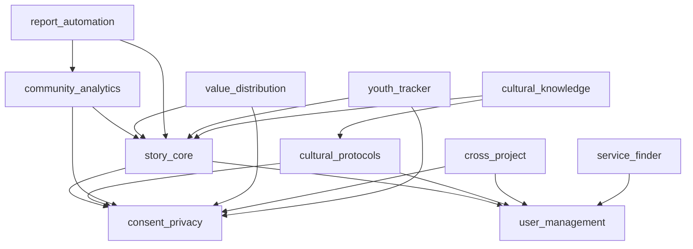

# Feature to Module Mapping

## Current Features → Proposed Modules

### Core Story Module (`story_core`)

**Current Features:**

- Story submission (web, SMS, WhatsApp, voice, video)
- Privacy levels (private, community, public)
- Consent management
- Story metadata and tags
- Multi-modal content support

**Module Configuration:**

```json
{
  "submission_methods": ["web", "sms", "whatsapp", "voice", "video"],
  "consent_flow": "standard",
  "privacy_defaults": "community",
  "auto_transcribe": true,
  "supported_languages": ["en", "indigenous_aus"]
}
```

### Cultural Protocols Module (`cultural_protocols`)

**Current Features:**

- Seasonal restrictions
- Elder review requirements
- Sacred/cultural warnings
- Gender-specific access controls
- Cultural protocol notes

**Module Configuration:**

```json
{
  "require_elder_review": true,
  "seasonal_restrictions": true,
  "cultural_warnings": ["mens_business", "womens_business", "sorry_business"],
  "protocol_training_required": true,
  "custom_protocols": []
}
```

### Analytics & Insights Module (`community_analytics`)

**Current Features:**

- Story analysis (themes, patterns, sentiment)
- Community insights
- Project analytics
- Cross-project insights (with consent)
- Sovereignty tracking

**Module Configuration:**

```json
{
  "analysis_types": ["themes", "sentiment", "patterns", "impact"],
  "community_centered_metrics": true,
  "cross_project_insights": false,
  "sovereignty_dashboard": true,
  "custom_metrics": []
}
```

### Consent & Privacy Module (`consent_privacy`)

**Current Features:**

- Granular consent settings
- Usage tracking
- Consent withdrawal
- Data sovereignty controls
- Privacy level management

**Module Configuration:**

```json
{
  "consent_granularity": "detailed",
  "track_usage": true,
  "allow_withdrawal": true,
  "default_privacy": "community",
  "consent_ui": "conversational"
}
```

### Economic Justice Module (`value_distribution`)

**Current Features:**

- Payment tracking
- Value event logging
- Revenue distribution
- Economic benefit tracking
- Transparent reporting

**Module Configuration:**

```json
{
  "enable_payments": true,
  "distribution_model": "community_first",
  "transparency_level": "full",
  "payment_methods": ["bank_transfer", "mobile_money"],
  "reporting_frequency": "monthly"
}
```

### User & Access Module (`user_management`)

**Current Features:**

- Role-based access control
- Project membership
- Cultural training tracking
- Permission management
- Multi-project support

**Module Configuration:**

```json
{
  "roles": ["owner", "admin", "editor", "storyteller", "viewer"],
  "require_cultural_training": true,
  "multi_project_users": true,
  "custom_permissions": [],
  "sso_enabled": false
}
```

### Collaboration Module (`cross_project`)

**Current Features:**

- Project connections
- Shared insights
- Collaborative stories
- Inter-project messaging
- Consent-based sharing

**Module Configuration:**

```json
{
  "allow_connections": true,
  "require_mutual_consent": true,
  "shared_insights": true,
  "collaborative_stories": true,
  "connection_types": ["research", "advocacy", "community"]
}
```

## New Modules from Your Architecture

### Report Builder Module (`report_automation`)

**Proposed Features:**

- Automated report generation
- Stakeholder dashboards
- Template library
- Schedule reports
- Multi-format export

**Module Configuration:**

```json
{
  "templates": ["annual", "quarterly", "impact", "stakeholder"],
  "auto_include_stories": true,
  "scheduling_enabled": true,
  "export_formats": ["pdf", "docx", "html", "data"],
  "dashboard_access": true
}
```

### Youth Services Module (`youth_tracker`)

**Proposed Features:**

- Goal tracking
- Mentorship matching
- Progress monitoring
- Safe space mapping
- Outcome measurement

**Module Configuration:**

```json
{
  "track_goals": true,
  "mentorship_enabled": true,
  "progress_indicators": ["wellbeing", "education", "housing", "employment"],
  "safe_space_mapping": true,
  "guardian_consent": true
}
```

### Knowledge Preservation Module (`cultural_knowledge`)

**Proposed Features:**

- Knowledge categorization
- Seasonal knowledge tracking
- Elder knowledge capture
- Cultural education paths
- Knowledge access protocols

**Module Configuration:**

```json
{
  "knowledge_categories": [
    "dreamtime",
    "bush_medicine",
    "language",
    "ceremony"
  ],
  "seasonal_tracking": true,
  "elder_profiles": true,
  "education_paths": true,
  "access_protocols": "strict"
}
```

### Location Services Module (`service_finder`)

**Proposed Features:**

- Service directory
- Real-time availability
- Eligibility checking
- Distance calculation
- Safe route planning

**Module Configuration:**

```json
{
  "service_types": ["shelter", "counseling", "legal", "health", "education"],
  "real_time_updates": true,
  "eligibility_engine": true,
  "map_integration": true,
  "anonymous_access": true
}
```

## Module Dependencies



## Module Enablement Strategy

### Tier 1: Essential Modules (All Projects)

- `story_core`
- `consent_privacy`
- `user_management`

### Tier 2: Standard Modules (Most Projects)

- `community_analytics`
- `cultural_protocols`
- `value_distribution`

### Tier 3: Specialized Modules (Specific Use Cases)

- `youth_tracker` (Youth services)
- `cultural_knowledge` (Indigenous organizations)
- `report_automation` (Large organizations)
- `service_finder` (Service providers)
- `cross_project` (Research collaboratives)

## Migration Path

### Phase 1: Core Module Extraction

1. Extract existing story features → `story_core`
2. Extract consent features → `consent_privacy`
3. Extract user features → `user_management`

### Phase 2: Feature Modularization

1. Move analytics → `community_analytics`
2. Move protocols → `cultural_protocols`
3. Move payments → `value_distribution`

### Phase 3: New Module Development

1. Build `report_automation` for JusticeHub
2. Build `youth_tracker` for youth organizations
3. Build `cultural_knowledge` for Wilya Janta
4. Build `service_finder` for service providers

### Phase 4: Module Marketplace

1. Create module registry
2. Build enable/disable UI
3. Implement module configuration
4. Launch module marketplace

## Module Pricing Strategy

### Included in All Tiers

- `story_core`
- `consent_privacy`
- `user_management`

### Community Tier

- - `community_analytics` (basic)
- - `cultural_protocols`

### Organization Tier

- - `community_analytics` (full)
- - `value_distribution`
- - `cross_project`
- - Choose 1 specialized module

### Enterprise Tier

- All modules included
- Custom module development
- Priority support
- Custom integrations

## Technical Implementation

### Module Interface

```typescript
interface Module {
  id: string;
  key: string;
  name: string;
  category: 'core' | 'analytics' | 'management' | 'specialized';

  // Dependencies
  requires: string[]; // Other module keys

  // Configuration
  configSchema: JSONSchema;
  defaultConfig: Record<string, any>;

  // Lifecycle
  onEnable: (projectId: string, config: any) => Promise<void>;
  onDisable: (projectId: string) => Promise<void>;
  onConfigure: (projectId: string, config: any) => Promise<void>;

  // Permissions
  permissions: Permission[];

  // UI Components
  components: {
    settings?: React.Component;
    dashboard?: React.Component;
    menu?: MenuItem[];
  };
}
```

### Module Registry

```typescript
class ModuleRegistry {
  private modules: Map<string, Module> = new Map();

  register(module: Module): void {
    this.validateDependencies(module);
    this.modules.set(module.key, module);
  }

  async enableForProject(
    projectId: string,
    moduleKey: string,
    config?: any
  ): Promise<void> {
    const module = this.modules.get(moduleKey);
    if (!module) throw new Error(`Module ${moduleKey} not found`);

    // Check dependencies
    await this.ensureDependencies(projectId, module);

    // Enable module
    await module.onEnable(projectId, config || module.defaultConfig);

    // Update database
    await supabase.from('project_modules').insert({
      project_id: projectId,
      module_key: moduleKey,
      enabled: true,
      configuration: config || module.defaultConfig,
    });
  }
}
```

This mapping shows how your existing features naturally fit into a modular architecture while identifying new modules that serve specific community needs. The phased approach ensures smooth migration without disrupting current users.
