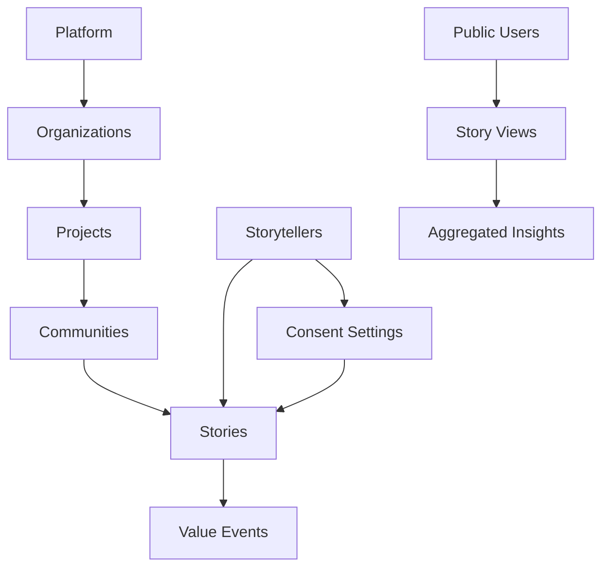

# The Empathy Ledger Database Architecture Strategy

## From Community Stories to Global Impact

### Table of Contents

1. [Executive Summary](#executive-summary)
2. [Project Evolution & Current State](#project-evolution--current-state)
3. [Vision & Future State](#vision--future-state)
4. [Database Architecture Design](#database-architecture-design)
5. [Migration Strategy from Airtable](#migration-strategy-from-airtable)
6. [Backup & Disaster Recovery](#backup--disaster-recovery)
7. [Storyteller-Led Access Model](#storyteller-led-access-model)
8. [Multi-Tenant Architecture](#multi-tenant-architecture)
9. [Indigenous Data Sovereignty](#indigenous-data-sovereignty)
10. [Public Communication Strategy](#public-communication-strategy)
11. [Implementation Roadmap](#implementation-roadmap)

---

## Executive Summary

The Empathy Ledger is evolving from a single-purpose storytelling platform into the foundational data layer for A Curious Tractor's ecosystem of social impact projects. This document outlines a bulletproof strategy for establishing a Supabase database architecture that prioritizes data sovereignty, community agency, and scalable multi-tenant support while ensuring zero data loss during migration from Airtable.

### Key Principles

- **Data Sovereignty First**: Communities and storytellers maintain control over their narratives
- **Zero Data Loss**: Professional backup systems and migration safeguards
- **Scalable Architecture**: Supporting multiple organizations and projects
- **Transparent Governance**: Clear, public-facing documentation of data practices

---

## Project Evolution & Current State

### Where We Started

The Empathy Ledger began as a platform to collect and share community stories with a focus on:

- Indigenous storytelling traditions
- Community-controlled narratives
- Benefit distribution tracking
- Cultural protocol preservation

### Where We Are Now

Current implementation includes:

- **30+ database tables** with comprehensive schema
- **TypeScript-first development** with full type safety
- **Row Level Security (RLS)** on all sensitive data
- **Multi-project support** beginning to emerge
- **Legacy data in Airtable** requiring migration

### Lessons Learned

1. **Data deletion incidents** taught us the critical importance of:
   - Automated backups before any schema changes
   - Migration scripts with rollback capabilities
   - Clear separation between development and production
2. **Community feedback** emphasized needs for:
   - More granular consent controls
   - Better storyteller attribution
   - Clearer data ownership models

---

## Vision & Future State

### The Empathy Ledger as Foundation

```
┌─────────────────────────────────────────┐
│      A Curious Tractor Ecosystem        │
├─────────────────────────────────────────┤
│  Project A  │  Project B  │  Project C  │
├─────────────────────────────────────────┤
│        The Empathy Ledger Core          │
│    (Stories, Communities, Insights)     │
├─────────────────────────────────────────┤
│         Supabase Infrastructure         │
│    (PostgreSQL, Auth, Storage, RLS)     │
└─────────────────────────────────────────┘
```

### Target Capabilities

1. **Multiple Organizations** can build on the platform
2. **Storytellers** maintain ownership and control
3. **Communities** govern their collective narratives
4. **Insights** roll up across projects while respecting privacy
5. **Projects** can white-label while contributing to the commons

---

## Database Architecture Design

### Core Schema Hierarchy

```sql
-- 1. Platform Level (Shared across all projects)
platform_config
platform_modules
platform_analytics

-- 2. Organization Level (Companies/Nonprofits)
organizations
├── organization_members
├── organization_settings
└── organization_billing

-- 3. Project Level (Built on Empathy Ledger)
projects
├── project_members
├── project_settings
├── project_domains
└── project_themes

-- 4. Community Level (Geographic/Thematic Groups)
communities
├── community_members
├── community_protocols
├── community_insights
└── community_governance

-- 5. Story Level (Core Content)
stories
├── story_versions
├── story_consent
├── story_attribution
├── story_media
├── story_analysis
├── story_reactions
└── story_comments

-- 6. Value Distribution
value_events
├── value_distributions
├── value_recipients
└── value_metrics
```

### Data Relationships



### Security Layers

1. **Row Level Security (RLS)**

   ```sql
   -- Example: Stories visible based on privacy settings
   CREATE POLICY "story_visibility" ON stories
   FOR SELECT USING (
     privacy_level = 'public' OR
     (privacy_level = 'community' AND is_community_member(auth.uid(), community_id)) OR
     (privacy_level = 'organization' AND is_org_member(auth.uid(), organization_id)) OR
     (auth.uid() = storyteller_id)
   );
   ```

2. **Column Level Encryption**
   - Sensitive personal information
   - Payment details
   - Private consent preferences

3. **API Gateway Protection**
   - Rate limiting per organization
   - API key rotation
   - Request validation

---

## Migration Strategy from Airtable

### Phase 1: Data Audit & Mapping (Week 1)

1. **Export All Airtable Data**

   ```javascript
   // scripts/airtable-export.js
   const exportAirtableData = async () => {
     const tables = ['Stories', 'Storytellers', 'Communities', 'Projects'];
     const exports = {};

     for (const table of tables) {
       exports[table] = await airtable
         .base(AIRTABLE_BASE)
         [table].select({ view: 'All Records' })
         .all();
     }

     // Save with timestamp
     fs.writeFileSync(
       `backups/airtable-export-${Date.now()}.json`,
       JSON.stringify(exports, null, 2)
     );
   };
   ```

2. **Create Mapping Document**
   - Field-by-field mapping from Airtable to Supabase
   - Data transformation requirements
   - Validation rules

### Phase 2: Staging Migration (Week 2)

1. **Set Up Staging Database**

   ```sql
   -- Create staging schema
   CREATE SCHEMA staging;

   -- Mirror production tables in staging
   CREATE TABLE staging.stories AS TABLE public.stories WITH NO DATA;
   ```

2. **Run Migration Scripts**

   ```javascript
   // scripts/migrate-to-staging.js
   const migrateToStaging = async airtableData => {
     const { Stories } = airtableData;

     for (const story of Stories) {
       // Transform and validate
       const transformed = transformStoryData(story);
       const validated = await validateStoryData(transformed);

       // Insert into staging
       await supabase.from('staging.stories').insert(validated);
     }
   };
   ```

### Phase 3: Validation & Testing (Week 3)

1. **Data Integrity Checks**

   ```sql
   -- Verify record counts
   SELECT
     'airtable' as source, COUNT(*) as count
   FROM staging.airtable_stories
   UNION ALL
   SELECT
     'migrated' as source, COUNT(*) as count
   FROM staging.stories;
   ```

2. **Application Testing**
   - Point development environment to staging
   - Run full test suite
   - Manual verification of critical paths

### Phase 4: Production Migration (Week 4)

1. **Final Backup**

   ```bash
   # Create point-in-time backup
   pg_dump $SUPABASE_DB_URL > backups/pre-migration-$(date +%s).sql
   ```

2. **Execute Migration**
   - Run during low-traffic window
   - Monitor in real-time
   - Have rollback script ready

3. **Post-Migration Validation**
   - Verify all data transferred
   - Check application functionality
   - Monitor error logs

---

## Backup & Disaster Recovery

### Automated Backup Strategy

1. **Continuous Replication**

   ```yaml
   # supabase/backup-config.yml
   backup:
     continuous:
       enabled: true
       retention_days: 30
       point_in_time_recovery: true
   ```

2. **Daily Snapshots**

   ```bash
   # scripts/daily-backup.sh
   #!/bin/bash
   TIMESTAMP=$(date +%Y%m%d_%H%M%S)

   # Database backup
   pg_dump $SUPABASE_DB_URL | gzip > backups/db_$TIMESTAMP.sql.gz

   # Storage backup
   supabase storage download --recursive / backups/storage_$TIMESTAMP/

   # Upload to S3
   aws s3 sync backups/ s3://empathy-ledger-backups/
   ```

3. **Weekly Full Exports**
   - Complete database export
   - All media files
   - Configuration snapshots
   - Encrypted and stored off-site

### Recovery Procedures

1. **Point-in-Time Recovery**

   ```sql
   -- Restore to specific timestamp
   SELECT pg_restore_to_timestamp('2024-01-15 14:30:00');
   ```

2. **Partial Recovery**
   - Single table restoration
   - User-specific data recovery
   - Story-level rollback

3. **Disaster Recovery Plan**
   - Primary: Supabase managed backups
   - Secondary: S3 encrypted backups
   - Tertiary: Local encrypted archives
   - Recovery Time Objective (RTO): 4 hours
   - Recovery Point Objective (RPO): 1 hour

---

## Storyteller-Led Access Model

### Core Principles

1. **Storyteller Agency**
   - Stories belong to their creators
   - Granular sharing controls
   - Revenue/benefit attribution
   - Right to deletion

2. **Access Hierarchy**

   ```
   Storyteller (Full Control)
   ├── Story Editor (Designated Editors)
   ├── Community Reviewer (Cultural Protocols)
   ├── Organization Viewer (Platform Access)
   └── Public Viewer (Shared Stories Only)
   ```

3. **Consent Management**
   ```typescript
   interface StoryConsent {
     public_sharing: boolean;
     community_sharing: boolean;
     organization_sharing: boolean;
     ai_analysis: boolean;
     commercial_use: boolean;
     attribution_required: boolean;
     modification_allowed: boolean;
     distribution_channels: string[];
   }
   ```

### Implementation

```sql
-- Storyteller dashboard view
CREATE VIEW storyteller_dashboard AS
SELECT
  s.id,
  s.title,
  s.created_at,
  COUNT(DISTINCT sr.id) as reaction_count,
  COUNT(DISTINCT sc.id) as comment_count,
  COUNT(DISTINCT sv.id) as view_count,
  COALESCE(SUM(ve.amount), 0) as total_value_generated
FROM stories s
LEFT JOIN story_reactions sr ON s.id = sr.story_id
LEFT JOIN story_comments sc ON s.id = sc.story_id
LEFT JOIN story_views sv ON s.id = sv.story_id
LEFT JOIN value_events ve ON s.id = ve.story_id
WHERE s.storyteller_id = auth.uid()
GROUP BY s.id;
```

---

## Multi-Tenant Architecture

### Project Isolation

1. **Data Segregation**

   ```sql
   -- Project-specific views
   CREATE VIEW project_stories AS
   SELECT * FROM stories
   WHERE project_id = current_setting('app.current_project_id')::uuid;
   ```

2. **Custom Domains**

   ```typescript
   // middleware.ts
   export async function middleware(request: NextRequest) {
     const hostname = request.headers.get('host');
     const project = await getProjectByDomain(hostname);

     if (project) {
       // Set project context
       request.headers.set('X-Project-Id', project.id);
     }
   }
   ```

3. **Resource Limits**
   - Stories per project
   - Storage quotas
   - API rate limits
   - User seats

### Cross-Project Analytics

1. **Aggregated Insights**

   ```sql
   -- Platform-wide analytics (privacy-respecting)
   CREATE MATERIALIZED VIEW platform_insights AS
   SELECT
     DATE_TRUNC('month', created_at) as month,
     COUNT(DISTINCT storyteller_id) as unique_storytellers,
     COUNT(*) as total_stories,
     AVG(engagement_score) as avg_engagement
   FROM stories
   WHERE privacy_level = 'public'
   GROUP BY month;
   ```

2. **Community Impact Metrics**
   - Total value distributed
   - Stories per community
   - Engagement patterns
   - Benefit distribution equity

---

## Indigenous Data Sovereignty

### CARE Principles Implementation

1. **Collective Benefit**

   ```typescript
   interface CommunityBenefitSettings {
     benefit_sharing_model: 'equal' | 'contribution' | 'custom';
     decision_making_process: 'consensus' | 'majority' | 'elder_council';
     value_distribution_rules: ValueDistributionRule[];
   }
   ```

2. **Authority to Control**
   - Community-appointed data stewards
   - Cultural protocol enforcement
   - Story approval workflows
   - Access governance

3. **Responsibility**
   - Data use agreements
   - Impact reporting
   - Ethical AI training exclusions
   - Cultural sensitivity reviews

4. **Ethics**
   ```sql
   -- Cultural protocol enforcement
   CREATE TABLE cultural_protocols (
     id UUID PRIMARY KEY,
     community_id UUID REFERENCES communities(id),
     protocol_type TEXT,
     requirements JSONB,
     enforcement_level TEXT CHECK (enforcement_level IN ('required', 'recommended', 'optional'))
   );
   ```

### Implementation Features

1. **Community Data Stewards**

   ```typescript
   interface DataSteward {
     user_id: string;
     community_id: string;
     permissions: {
       approve_stories: boolean;
       modify_protocols: boolean;
       manage_access: boolean;
       export_data: boolean;
     };
   }
   ```

2. **Sovereignty Dashboard**
   - Data location transparency
   - Access audit logs
   - Export capabilities
   - Deletion rights

---

## Public Communication Strategy

### For Storytellers

> "Your stories remain yours. You control who sees them, how they're shared, and what benefits they generate. We're just the platform that amplifies your voice while respecting your sovereignty."

### For Communities

> "The Empathy Ledger operates like a digital gathering place where your community's stories are shared according to your protocols. You maintain collective governance over your narratives."

### For Organizations

> "Build on a platform that prioritizes ethical data practices. Access community insights while respecting sovereignty. Create positive impact through story-driven development."

### Technical Transparency

1. **Public Documentation**
   - Open source components
   - API documentation
   - Data flow diagrams
   - Security practices

2. **Regular Reports**
   - Monthly platform statistics
   - Impact metrics
   - Security audit results
   - Community feedback integration

---

## Implementation Roadmap

### Month 1: Foundation

- [ ] Complete Airtable data export and backup
- [ ] Finalize Supabase schema design
- [ ] Implement automated backup systems
- [ ] Create staging environment

### Month 2: Migration

- [ ] Execute staging migration
- [ ] Comprehensive testing
- [ ] Fix identified issues
- [ ] Production migration

### Month 3: Enhancement

- [ ] Implement storyteller dashboards
- [ ] Deploy multi-tenant features
- [ ] Launch sovereignty controls
- [ ] Public documentation

### Month 4: Scale

- [ ] Onboard first external organization
- [ ] Implement cross-project analytics
- [ ] Launch community steward program
- [ ] Performance optimization

### Ongoing: Maintenance

- Weekly backup verification
- Monthly security audits
- Quarterly community reviews
- Annual sovereignty assessment

---

## Critical Success Factors

1. **Zero Data Loss**: Every migration must be reversible
2. **Community Trust**: Transparent operations and governance
3. **Technical Excellence**: Performance, security, and reliability
4. **Cultural Respect**: Indigenous data sovereignty at the core
5. **Sustainable Growth**: Scalable without compromising values

---

## Appendices

### A. Migration Checklist

- [ ] All Airtable data exported
- [ ] Backup systems tested
- [ ] Staging migration successful
- [ ] All tests passing
- [ ] Community notification sent
- [ ] Rollback plan ready
- [ ] Monitoring dashboard active
- [ ] Support team briefed

### B. Emergency Contacts

- Database Administrator: [Contact]
- Security Lead: [Contact]
- Community Liaison: [Contact]
- Legal Counsel: [Contact]

### C. Related Documents

- Technical Architecture Diagram
- API Documentation
- Security Audit Reports
- Community Agreements
- Legal Framework

---

_This document is a living guide that will evolve with community needs and technological capabilities. Last updated: [Date]_
